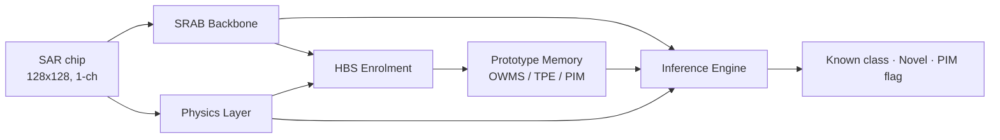

# ProtoEvoNet

**Physics-Aware Meta-Learning for Open-World SAR Target Recognition**

ProtoEvoNet is a few-shot, open-world recognition system for Synthetic Aperture Radar (SAR) imagery. It combines a physics-aware convolutional backbone, a hippocampus-inspired prototype-binding system for **online class enrolment**, an evolving prototype memory, and a calibrated **novelty detector** that flags targets from classes the model has never seen. The system can learn a new target class from only a handful of support chips — without retraining — and decide whether a new observation is a *known* class or a *novel* one.

---

## Table of Contents

- [Why ProtoEvoNet](#why-protoevonet)
- [Key Features](#key-features)
- [System Architecture](#system-architecture)
- [Repository Structure](#repository-structure)
- [Installation](#installation)
- [Datasets](#datasets)
- [Quickstart](#quickstart)
- [Inference API](#inference-api)
- [Configuration & Ablations](#configuration--ablations)
- [Experiments & Reproduction](#experiments--reproduction)
- [Figures](#figures)
- [Results at a Glance](#results-at-a-glance)
- [Troubleshooting](#troubleshooting)
- [Citation](#citation)
- [License](#license)

---

## Why ProtoEvoNet

Conventional SAR classifiers assume a **fixed, closed set** of target classes and require full retraining to add a new one. Operational maritime and ground surveillance is **open-world**: new vessel/vehicle types appear continuously, labelled examples are scarce, and the system must say "I don't recognise this" rather than force every observation into a known class.

ProtoEvoNet addresses this with three ideas working together:

1. **Physics-aware features** — SAR speckle follows a Gamma intensity distribution; the backbone and the physics layer explicitly model shape parameter `k`, scale `θ`, SNR and related descriptors, so the embedding is grounded in radar physics rather than optical-style texture alone.
2. **Online enrolment via a Hippocampal Binding System (HBS)** — new classes are enrolled from a few support chips through a Bayesian prototype-calibration pipeline, no gradient updates required.
3. **Calibrated novelty detection** — a physics-informed LDA score with Platt calibration separates known from novel targets and yields a usable operating threshold (FPR @ 95 % TPR).

---

## Key Features

- **Few-shot recognition** — 1/5/10/20-shot evaluation on FUSAR-Ship, OpenSARShip, and MSTAR.
- **Open-world / novelty detection** — known-vs-novel scoring with AUROC and FPR@95TPR metrics.
- **Online class enrolment** — add classes at inference time from a small support set (no retraining).
- **Two-phase training** — contrastive pre-training on HRSID, then episodic meta-learning on FUSAR-Ship.
- **Cross-domain evaluation** — frozen-backbone transfer across three SAR datasets.
- **Fully ablatable** — every major module has a binary toggle in a single config dataclass.
- **Reproducible** — one trained checkpoint reproduces every reported experiment via scripts.

---

## System Architecture

ProtoEvoNet is organised as a pipeline of seven subsystems (one Python package each):



| Package | Role | Key components |
|---|---|---|
| `backbone/` | Physics-aware feature extractor (**SRAB**) | `RadialAwareConv2d`, Gamma-Conditioned Norm (GCN), `CrossScaleAttention`, FPN → 256-D L2-normalised embedding |
| `physics/` | Radar-physics descriptors | Gamma statistics (`k`, `θ`), DSAR, SNR estimation, Fisher–Rao distance |
| `hippocampus/` | **HBS** — online enrolment | SQAA (quality), Sanitisation Gate, AGPPI (prior), APM (precision), BPC-GP (Bayesian calibration), DSAR smoother |
| `memory/` | Evolving prototype store | OWMS (working memory), PIM (interference monitor), TPE (temporal evolution) |
| `inference/` | Decision layer | Prototype matching, physics LDA novelty, Platt calibration, 4-mode `InferenceEngine` |
| `training/` | Two-phase learning | HRSID/FUSAR datasets, episodic sampler, AGCP loss (Phase 1), PIAM loss (Phase 2) |
| `utils/` | Plumbing | `ProtoEvoNetConfig`, checkpointing, metrics, logging |

**Inference modes** (`inference.engine.InferenceMode`): `RECOGNITION`, `NOVELTY`, `ENROLMENT`, `REFINEMENT`.

**Two-phase training:**
- **Phase 1 — Contrastive pre-training (HRSID):** SRAB backbone trained with the **AGCP** loss (InfoNCE + physics-guided hard-negative mining). *Optional* — if HRSID is absent, Phase 2 starts from a random backbone.
- **Phase 2 — Episodic meta-learning (FUSAR-Ship):** N-way K-shot episodes with the **PIAM** loss (`λ_proto·L_proto + λ_physics·L_physics + λ_novelty·L_novelty`), driving the HBS enrolment path and prototype memory.

---

## Repository Structure

```
ProtoEvoNet/
├── main.py                     # Entry point: training + demo + low-shot eval
├── prepare_opensarship.py      # OpenSARShip 2.0 loader + split builder
├── cross_domain_eval.py        # Frozen-backbone cross-domain evaluation
├── baseline_novelty.py         # OpenMax / Energy / KNN / CSI / ARPL baselines
├── count_parameters.py         # Per-module parameter accounting
├── ablation_study.py           # Full ablation runner
├── eval_enrolment.py           # Enrolment / shape-filtering evaluation
├── multi_seed_enrolment.py     # Multi-seed enrolment stability
├── protonet_baseline.py        # ProtoNet reference baseline
├── tsne_visualisation.py       # t-SNE embedding plot
├── visualize_predictions.py    # Per-chip prediction grid (truth vs pred)
├── run_all_experiments.sh      # Master reproduction script
├── README_EXPERIMENTS.md       # Full experiment reproduction guide
│
├── backbone/  physics/  hippocampus/  memory/  inference/  training/  utils/
│
├── figures/                    # Publication figures + their generators
│   ├── generate_architecture_figures.py   # architecture_*.png/pdf, parameter_scale
│   └── generate_data_figures.py            # confusion matrices, curves, heatmaps, ...
│
├── data/                       # Datasets (not tracked) — see below
├── results/  logs/             # Experiment outputs
└── checkpoints/                # Saved weights (phase1/, phase2/, best_model.pt)
```

---

## Installation

Python **3.9+** is recommended (the reference environment uses 3.12).

```bash
# 1. Clone
git clone https://github.com/TheDagbanja/ProtoEvoNet.git
cd ProtoEvoNet

# 2. (recommended) create an environment
conda create -n protoevo python=3.10 -y
conda activate protoevo

# 3. PyTorch (CUDA 11.8 build shown; pick the wheel for your CUDA/CPU)
pip install torch torchvision torchaudio --index-url https://download.pytorch.org/whl/cu118

# 4. Scientific stack
pip install numpy scipy scikit-learn matplotlib seaborn pillow tqdm
```

Verify:

```bash
python -c "import torch; print(torch.__version__, torch.cuda.is_available())"
```

> **Conda + `CXXABI` import errors?** If `import matplotlib`/`scipy` fails with
> `libstdc++.so.6: version 'CXXABI_1.3.15' not found`, your system `libstdc++`
> is shadowing the conda one. Fix it with
> `conda install -c conda-forge libstdcxx-ng` and, if needed, preload the conda
> copy: `export LD_PRELOAD=$CONDA_PREFIX/lib/libstdc++.so.6`.

---

## Datasets

Datasets are **not** tracked in git. Place them under `data/`:

| Dataset | Purpose | Expected path |
|---|---|---|
| **FUSAR-Ship** | Phase 2 meta-learning + main evaluation (10 stable classes) | `data/fusar_ship/<Class>/*.png` |
| **MSTAR** | Cross-domain + novelty (10 vehicle classes, SLICY excluded) | `data/mstar/<Class>/*.jpeg` |
| **OpenSARShip 2.0** | Cross-domain + novelty | `data/open_sar/OpenSARShip2/...` |
| **HRSID** | Phase 1 contrastive pre-training (*optional*) | `data/hrsid/images/`, `data/hrsid/annotations/` |

Build the OpenSARShip splits after downloading:

```bash
python prepare_opensarship.py \
    --data-root data/open_sar/OpenSARShip2 \
    --output-dir data \
    --min-count 100
```

Full dataset layout, class lists, and rationale (e.g. why low-count FUSAR classes and MSTAR's SLICY are excluded) are documented in **[README_EXPERIMENTS.md § 2](README_EXPERIMENTS.md#2-dataset-preparation)**.

---

## Quickstart

**Train the full pipeline (Phase 1 + Phase 2):**
```bash
python main.py --data-root data --device cuda --seed 42
```

**Phase 2 only, from a Phase 1 checkpoint:**
```bash
python main.py --phase2-only --backbone-ckpt checkpoints/phase1/best.pt \
    --data-root data --device cuda
```

**Low-shot evaluation (1/5/10/20-shot, 5 seeds):**
```bash
python main.py --demo-only --system-ckpt checkpoints/best_model.pt \
    --data-root data --device cuda \
    --low-shot-eval --dataset fusar --n-shot 1 5 10 20 --n-seeds 5
```

**Cross-domain evaluation (frozen backbone, all three datasets):**
```bash
python cross_domain_eval.py --checkpoint checkpoints/best_model.pt \
    --fusar-root data/fusar_ship \
    --opensarship-root data/open_sar/OpenSARShip2 \
    --mstar-root data/mstar \
    --n-shot 10 --n-seeds 5 --output results/cross_domain.csv --device cuda
```

**Visualise predictions (truth vs prediction grid → PNG + PDF):**
```bash
python visualize_predictions.py --system-ckpt checkpoints/phase2/best.pt \
    --dataset fusar --n-classes 10 --n-enrol 5 --n-samples 12
```

---

## Inference API

The package exposes the core building blocks for programmatic use:

```python
import torch
from utils.config import ProtoEvoNetConfig
from backbone.srab import SRABBackbone
from inference.engine import ProtoEvoNetInferenceEngine, InferenceMode

cfg = ProtoEvoNetConfig()
# ... build the engine (see visualize_predictions.py: build_system / load_engine
#     for a complete, working assembly of backbone + physics + HBS + memory) ...

# Enrol a new class from a few support chips (no retraining):
engine.enrol(support_images, label="NewVesselType")   # support_images: (K, 1, 128, 128)

# Recognise a query chip:
result = engine.recognise(query_image)                 # query_image: (1, 1, 128, 128)
print(result.predicted_label, result.confidence)
```

`visualize_predictions.py` contains a self-contained `build_system(cfg)` / `load_engine(ckpt, cfg, device)` reference you can copy for wiring the full engine.

---

## Configuration & Ablations

All hyperparameters and toggles live in a single, JSON-serialisable dataclass tree in [`utils/config.py`](utils/config.py):

```python
from utils.config import ProtoEvoNetConfig

cfg = ProtoEvoNetConfig()
cfg.ablation.use_gcn = False     # disable Gamma-Conditioned Normalisation
cfg.apply_ablation()             # propagate ablation flags into sub-configs
cfg.save("run_config.json")
cfg2 = ProtoEvoNetConfig.load("run_config.json")   # unknown keys ignored
```

Every major module has an on/off flag in `AblationConfig`:
`use_radial_conv`, `use_cross_scale_attention`, `use_gcn`, `use_dsar`, `use_fisher_rao`,
`use_snr`, `use_sqaa`, `use_agppi`, `use_apm`, `use_bpc_gp`, `use_dsar_smoother`,
`use_pim`, `use_tpe`, `use_novelty`.

Ablate from the command line:
```bash
python main.py --demo-only --system-ckpt checkpoints/best_model.pt \
    --data-root data --ablate use_gcn=False
```
or run the full sweep with `ablation_study.py`.

---

## Experiments & Reproduction

Every result reproduces from **one trained checkpoint**. The master script runs the whole suite:

```bash
bash run_all_experiments.sh --checkpoint checkpoints/best_model.pt \
    --data-root data --device cuda
# add --dry-run to print the commands without executing
```

The full, step-by-step guide — per-experiment commands, output files, expected
numbers, and wall-clock estimates — is in **[README_EXPERIMENTS.md](README_EXPERIMENTS.md)**.

Covered experiments: parameter accounting, low-shot recognition (FUSAR /
OpenSARShip / MSTAR), cross-domain transfer, novelty-detection benchmark
(physics LDA vs OpenMax / Energy / KNN / CSI / ARPL and distance baselines),
and the module ablation study.

---

## Figures

Publication figures live in `figures/` and are regenerated by two scripts (each writes **PNG + vector PDF**, with bold, fully-labelled axes):

```bash
python figures/generate_architecture_figures.py   # architecture diagrams + parameter_scale
python figures/generate_data_figures.py           # confusion matrices, curves, heatmaps, ...
python tsne_visualisation.py --system-ckpt checkpoints/phase2/best.pt   # t-SNE (needs a checkpoint)
```

> Note: `generate_data_figures.py` rebuilds the result plots from reported
> values so they render with consistent, bold labelling; for camera-ready
> versions, feed it the raw result arrays (see the script's docstring). The
> t-SNE and prediction-grid figures are produced from a trained checkpoint.

---

## Results at a Glance

*Indicative numbers — exact values depend on the trained checkpoint; see
[README_EXPERIMENTS.md § 6](README_EXPERIMENTS.md#6-expected-results).*

**Low-shot recognition (FUSAR 10-class):**

| n-shot | Accuracy | Macro-F1 |
|-------:|---------:|---------:|
| 1  | ~52 % | ~48 % |
| 5  | ~72 % | ~69 % |
| 10 | ~80 % | ~77 % |
| 20 | ~85 % | ~83 % |

**Novelty detection (FUSAR known vs MSTAR novel):** the physics per-class LDA
head (**C1c**) reaches **AUROC ≈ 0.91** at **FPR@95TPR ≈ 0.20**, well ahead of
distance/energy baselines. Platt calibration is rank-invariant — it improves the
operating threshold, not AUROC.

---

## Troubleshooting

- **`CXXABI_1.3.15 not found`** on conda — see the note in [Installation](#installation).
- **HRSID missing** — Phase 1 is skipped automatically; Phase 2 runs from a random backbone.
- **CUDA not available** — pass `--device cpu` (slower); scripts fall back to CPU when CUDA is absent.
- **Physics descriptors** (`k, θ, SNR, SI, mean_intensity`) are computed on CPU by design to avoid CUDA sync issues.

---

## Citation

If you use ProtoEvoNet in your research, please cite this repository:

```bibtex
@software{protoevonet,
  author  = {{TheDagbanja} and the ProtoEvoNet Research contributors},
  title   = {ProtoEvoNet: Physics-Aware Meta-Learning for Open-World SAR Target Recognition},
  year    = {2025},
  url     = {https://github.com/TheDagbanja/ProtoEvoNet}
}
```

*(Update author/year and add a paper reference once published.)*

---

## License

No license file is currently included. Add a `LICENSE` (e.g. MIT or Apache-2.0)
to define how others may use this code; until then, all rights are reserved by
the authors.

---

## Acknowledgements

Built on FUSAR-Ship, OpenSARShip 2.0, MSTAR, and HRSID. ProtoEvoNet's design
draws on prototypical networks, hippocampal memory-binding models, and
SAR-specific speckle statistics.
